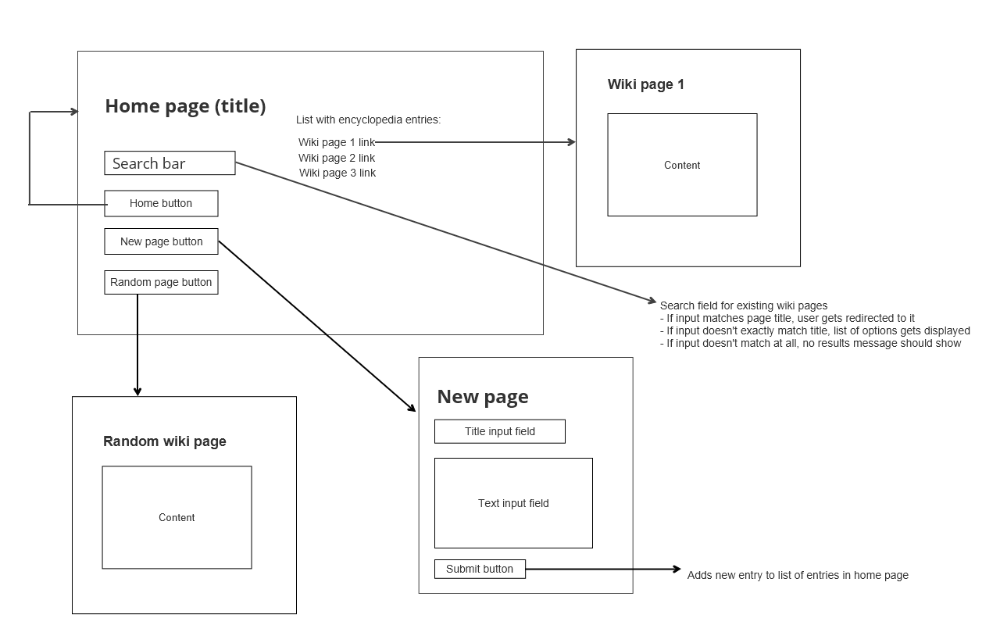

# Wiki

A Wikipedia-like online encyclopedia with the use of Django.


## Getting Started

To get started, you need to have Python3 and pip installed.
Once you've done that, run the following command in your terminal: 
```
pip3 install Django
```

To run the application, run the command:
```
python manage.py runserver
```

## Specification

#### Web Application Sketch




### Index (Home) Page
This page contains a list of links to wiki pages inside the encyclopedia. CLicking on that link will redirect the user to that particular entry page. It also features a search bar to find any existing wiki page, a link to create a new entry page and a link to a random page. 

#### Search Bar
If the user types a query in the search bar and it matches the name of an encyclopedia entry, the user should be redirected to that entry’s page. 

If the query does not match the name of an encyclopedia entry, the user should instead be taken to a search results page that displays a list of all encyclopedia entries that have the query as a substring. For example, if the search query were Py, then Python should appear in the search results.

Clicking on any of the entry names on the search results page should take the user to that entry’s page.

#### Create New Page
When a new page is created by the user, a number of files need to be changed in the encyclopedia directory:
* layout.html:
An href needs to be added so that the user can click on the 'Create new page' button and be redirected to a new page to create an entry.

* urls.py:
In this file a path needs to be added to the list of urlpatterns

* views.py:
A function needs to be created to store the new entry page and redirect the user to that page if it does not exist yet and if it does, the user will be presented with an error message.

## List of HTML Pages
HTML pages needed for this project:
* index.html
* entry.html
* layout.html
* new.html
* search.html
* error.html 
